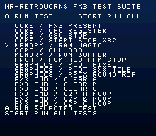

# SuperFX3

SuperFX3 firmware for RP2350B-based SNES cartridges.

This project implements the Super FX / GSU processor family in firmware, with SuperFX3 as the current hardware target. The RP2350B handles the SNES cartridge bus, runs the GSU core, and provides shared RAM and private FX ROM storage.

Copyright © 2026 NR-RetroWorks  
License: GNU GPL v3 or later

**UNDER ACTIVE DEVELOPMENT - WORK IN PROGRESS**

The host/static test suite passes. Hardware bring-up and final SNES timing validation are still in progress.

---

# Features

* Super FX / GSU instruction core with FX3 support
* RP2350B (SC1510-A4 80-QFN) running at 150 MHz
* Dual-core operation
  * Core 0 services the SNES cartridge bus
  * Core 1 executes FX code
* PIO/interrupt-based SNES bus decoding, read handling, write capture, and control
* 128 KiB (1 Mbit) of volatile shared cartridge RAM in RP2350 SRAM
  * 2 x 64 KiB banks at `$70:0000` and `$71:0000`
  * Leaves 392 KiB of RP2350 SRAM for firmware and runtime use
  * 216x144 visible 8bpp planar framebuffer in bank `$71`
* 4 MiB (32 Mbit) RP2350 QSPI flash
  * Lower 1 MiB for firmware
  * Upper 3 MiB for the private FX3 ROM image
* Separate parallel flash ROM for the SNES CPU
  * One device by default with an optional second
  * 1-64 Mbit per device, up to 128 Mbit total
  * LoROM, HiROM, ExLoROM, ExHiROM, extended SuperFX, and raw bus images
* FX3 8bpp PLOT/RPIX pixel-cache graphics path with native SNES planar output
* Planar-only framebuffer path with no separate chunky framebuffer
  * FX3 MERGE C2P commands are skipped because PLOT writeback already produces planar data
  * FX3 MERGE clear commands remain supported
* FX3 register access, RESET, STOP/GO, and cross-core synchronization
* Legacy GSU IRQ behavior for FX1/FX2 compatibility
* FX3 completion by R15 polling
* Host/static tests with architectural integration coverage and coverage reporting
* Menu-driven SNES diagnostic ROM for hardware FX3 testing

The current cartridge and timing path are being developed around FX3. Legacy GSU1/GSU2 cycle-accurate timing has not yet been validated on hardware.

---

# How It Works

The RP2350B splits the work between both cores:

* Core 0 services the SNES cartridge bus and cross-core communication.
* Core 1 runs FX code while the GSU is active.

PIO handles the timing-sensitive bus work, including SuperFX address decoding, SNES write capture, read service, and bus-control changes.

Banks `$70-$71` map to 128 KiB of RP2350 SRAM. The planar framebuffer lives in bank `$71`. The FX3 processor reads its private 3 MiB ROM image from the upper QSPI partition.

The QSPI FX3 ROM is separate from the SNES game ROM. The SNES address bus reaches the parallel ROM directly while PIO controls ROM output enable and optional ROM selection. ROM images are arranged for the physical flash layout before programming so normal CPU reads do not require live address remapping.

---

# Hardware

This firmware targets the (not yet released) NR-RetroWorks RP2350B SNES FX3 cartridge board.

The board definition is:

```text
boards/snes_fx3.h
```

CMake selects `snes_fx3` automatically and rejects other Pico board definitions.

## RP2350B Pin Setup

Signal | RP2350B GPIO | Description
--- | --- | ---
`A0-A15` | GPIO0-GPIO15 | Lower 16 address lines (of 24-line address bus)
`SYSCK` | GPIO19 | Optional 5A22 memory-cycle clock for future timing use
`/RD` | GPIO20 | CPU memory read strobe
`/WR` | GPIO21 | CPU memory write strobe
`/CART` / `/ROMSEL` | GPIO22 | Cartridge ROM select
`/RESET` | GPIO23 | Console reset
`/IRQ` | GPIO24 | Legacy GSU1/GSU2 cartridge interrupt request
`/PARD` | GPIO25 | Legacy GSU1/GSU2 expansion-port read strobe
`/PAWR` | GPIO26 | Legacy GSU1/GSU2 expansion-port write strobe
Internal SuperFX service select | GPIO27 | Internal SuperFX register access select
`/ROM0_OE` | GPIO28 | Primary parallel ROM output enable
`/ROM1_OE` | GPIO29 | Optional secondary parallel ROM output enable
`/BUS_OE` | GPIO30 | Cartridge bus transceiver output enable
`DATA_DIR` | GPIO31 | Data bus transceiver direction
`A16-A23` | GPIO32-GPIO39 | Upper 8 address lines (of 24-line address bus)
`D0-D7` | GPIO40-GPIO47 | 8-bit cartridge data bus

GPIO16-GPIO18 are unused. GPIO27 is internal to the cartridge and is generated by PIO0 from the address decode for SuperFX register transactions.

---

# Building

## Requirements

* Raspberry Pi Pico SDK 2.3.0 or newer
* ARM GCC toolchain with `arm-none-eabi-gcc` and `arm-none-eabi-g++`
* CMake
* Python 3
* cc65 with `ca65` and `ld65` for the diagnostic ROM

Set `PICO_SDK_PATH` if needed:

```bash
export PICO_SDK_PATH="$HOME/pico/pico-sdk"
```

Configure and build from the repository root:

```bash
cmake -S . -B build
cmake --build build -j"$(nproc)"
```

The main linked firmware output is:

```text
build/superfx3.elf
```

The Pico SDK also generates `.bin`, `.hex`, `.uf2`, map, and disassembly outputs. The raw `.bin` is used when creating a combined QSPI image.

---

# FX3 Diagnostic ROM

  
`testrom/` contains a SNES diagnostic application for exercising the FX3 implementation. The 65816 owns the menu, test setup, timeouts, validation, and display while small GSU kernels perform the operations under test.

Build it with:

```bash
python3 testrom/build.py
```

Or through CMake:

```bash
cmake --build build --target fx3_testrom
```

The build produces:

File | Purpose
--- | ---
`fx3_test.sfc` | 65816 supervisor for the parallel SNES ROM
`fx3_test_fxrom.bin` | Compact linked GSU test payload
`fx3_test_fxrom_partition.bin` | Full 3 MiB QSPI FX partition image
`fx3_test_manifest.json` | Hashes, sizes, QSPI offset, GSU entry points, and matched-pair ID

The suite covers register access, STOP, repeated START/STOP, shared RAM, ALU behavior, private ROM reads, ROM-to-ALU-to-RAM execution, PLOT, RPIX, CLEAR, and current FX3 C2P behavior. Graphics tests validate shared RAM before showing the result on screen.

Run source/layout checks without cc65:

```bash
python3 testrom/build.py --check
```

The native `ca65`/`ld65` build has been verified, and the 65816 supervisor UI has been smoke-tested in Snes9x. Hardware FX3 validation is still pending.

See `testrom/README.md` for the test ABI and programming-image details.

---

# SNES Parallel ROM Image

The SNES CPU uses one parallel ROM by default, with an optional second device for larger images. In dual-ROM builds, A23 selects ROM0 or ROM1.

Create a programming image with:

```bash
python3 src/tools/make_snes_rom_image.py \
    path/to/game.sfc \
    build/game_rom0.bin \
    --map lorom \
    --chip-size-mbit 64 \
    --rom-count 1
```

Each ROM may be 1, 2, 4, 8, 16, 32, or 64 Mbit. A second ROM is only needed when the image exceeds the selected single-device capacity or uses the A23=1 half of the bus.

For two ROMs:

```bash
cmake -S . -B build -DSNES_PARALLEL_ROM_COUNT=2
```

Supported mappings are `lorom`, `hirom`, `exlorom`, `exhirom`, `superfx-extended`, and `raw`. A 512-byte copier header is removed automatically for mapped SNES ROMs.

Programming images are padded to the selected physical ROM capacity with `0xFF`. Banks `$70-$71` remain reserved for shared SRAM.

---

# FX3 QSPI ROM Image

The board uses 4 MiB of QSPI flash:

```text
0x000000-0x0FFFFF  RP2350 firmware
0x100000-0x3FFFFF  FX3 private ROM
```

Create a combined image with:

```bash
python3 src/tools/make_fx3_qspi_image.py \
    build/superfx3.bin \
    path/to/fx3_rom.bin \
    build/superfx3_qspi.bin
```

The tool checks the flash size, 3 MiB FX3 ROM limit, 4 KiB partition alignment, and firmware/ROM overlap. Unused space is filled with `0xFF`.

---

# Testing

Run the host/static suite from `src`:

```bash
bash tests/run_tests.sh
```

This runs the processor and opcode tests, architectural tests, bus integration simulation, synchronization and backend tests, ROM packing tests, PIO static checks, and strict production-source stub links.

For coverage:

```bash
bash tests/run_coverage.sh
```

The report is written to:

```text
build/coverage/coverage_report.txt
```

Current coverage gates are:

* Portable `fx/*.cpp` line coverage of at least 95%
* Host-testable core, sync, and backend line coverage of at least 90%
* Branch alternatives taken at least once of at least 75%

The current suite passes. Host tests catch processor and integration problems, but real SNES timing, GPIO behavior, DMA timing, interrupt latency, and electrical behavior still require hardware validation.

---

# Source Layout

Path | Description
--- | ---
`boards/snes_fx3.h` | RP2350B board definition and cartridge GPIO map
`src/fx/` | SuperFX processor core, opcodes, registers, memory, and graphics
`src/platform/rp2350/` | RP2350 backend, synchronization, SNES bus, PIO, and DMA support
`src/tests/` | Host tests, PIO checks, SDK stubs, and coverage tools
`src/tools/` | ROM and QSPI image utilities
`testrom/` | SNES FX3 diagnostic ROM and GSU test kernels
`src/main.cpp` | Firmware startup, shared RAM, multicore setup, and main service loop

---

# Current Status

The host/static suite passes, the firmware builds with the Pico SDK toolchain, and the diagnostic ROM builds and runs in Snes9x.

Remaining hardware work includes:

* Real SNES bus timing and logic analyzer verification
* PIO timing under cartridge load
* Cross-core queue depth and worst-case service latency
* Final FX3 behavior checks against hardware and trusted traces
* Legacy GSU1/GSU2 timing if those modes remain supported

Expect things to move around during hardware bring-up.

---

# Credits

Portions of the SuperFX processor implementation are based on the GSU implementation from [Mesen Community Edition](https://github.com/nesdev-org/MesenCE), licensed under the GNU GPL.

Special thanks to Randy Linden and kandowantu.

Dedicated to Rebecca Heineman and Jennell Jaquays.

---

# License

SuperFX3 is licensed under the GNU General Public License, version 3 or later.

See `LICENSE` for the complete license text.
