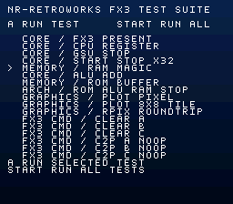

# SuperFX3 FOSS Firmware

SuperFX3 FOSS firmware for RP2350B-based SNES cartridges utilizing NR-RetroWorks developed interfacing.

**SuperFX3 Firmware v0.10.0**

This project implements the Super FX / GSU processor family in firmware, with SuperFX3 as the current hardware target. The RP2350B handles the SNES cartridge bus, runs the GSU core, and provides shared RAM plus private FX-code storage.

Copyright © 2026 NR-RetroWorks  
License: GNU GPL v3 or later

**UNDER ACTIVE DEVELOPMENT - WORK IN PROGRESS**

Hardware is currently in prototype phase and work continues on hardware validation, testing, and GSU-1/2 timing.

---

# Features

* Super FX / GSU instruction core with FX3 support
* RP2350B (SC1510-A4 80-QFN) running at 150 MHz
* Dual-core operation
  * Core 0 services the SNES cartridge bus
  * Core 1 executes FX code
* PIO/interrupt-based SNES bus decoding, read handling, write capture, and control
* 128 KiB (1 Mbit) of volatile shared cartridge RAM in RP2350 SRAM
  * 2 x 64 KiB banks at `$70:0000` and `$71:0000`
  * Leaves 392 KiB of RP2350 SRAM for firmware and runtime use
  * 216x144 visible 8bpp planar framebuffer in bank `$71` (FX3 mode)
* 4 MiB (32 Mbit) RP2350 QSPI flash
  * Lower 496 KiB for firmware
  * 528 KiB append-only SRAM save journal
  * Upper 3 MiB for private FX code and data
* Separate parallel flash ROM for the SNES CPU
  * One TSOP48/56 device on a single `/ROM_CE` output
  * 8-128 Mbit device capacity with full A0-A23 routing
  * LoROM, HiROM, ExLoROM, ExHiROM, extended SuperFX, and raw bus images
* FX3 8bpp PLOT/RPIX pixel-cache graphics path with native SNES planar output
* Planar-only framebuffer path with no separate chunky framebuffer
  * FX3 MERGE C2P commands are skipped because PLOT writeback already produces planar data
  * FX3 MERGE clear commands remain supported
  * `ALT1; MERGE` retains the original GSU MERGE operation
  * `ALT3; STOP` is terminal SAVE_AND_STOP, with completion only after durable QSPI save
* FX3 register access, RESET, STOP/GO, and cross-core synchronization
* Legacy GSU IRQ behavior for FX1/FX2 compatibility
* FX3 completion by R15 polling
* Host/static tests with architectural integration coverage and coverage reporting
* Menu-driven SNES diagnostic ROM for hardware FX3 testing

The current cartridge and timing path are being developed around FX3. Legacy GSU1/GSU2 cycle-accurate timing has not yet been validated on hardware.

---

# How It Works

The RP2350B splits the work between both cores:

* Core 0 services the SNES cartridge bus and cross-core communication.
* Core 1 runs FX code while the GSU is active.

PIO handles the timing-sensitive bus work, including SuperFX address decoding, SNES write capture, read service, and bus-control changes.

Banks `$70-$71` map to 128 KiB of RP2350 SRAM. The planar framebuffer lives in bank `$71`. The FX3 processor reads its private code and data from the upper 3 MiB QSPI partition.

The QSPI FX-code partition is separate from the SNES game/program ROM. Game ROM data exists only in the external 128-Mbit parallel NOR. The SNES address bus reaches that device directly while PIO controls `/RD`, `/WR`, and `/ROM_CE`. ROM images are arranged for the physical flash layout before programming so normal CPU reads do not require live address remapping.

---

# Hardware

This firmware targets the (not yet released) NR-RetroWorks RP2350B SNES FX3 cartridge board.

The board definition is:

```text
boards/snes_fx3.h
```

CMake selects `snes_fx3` automatically and rejects other Pico board definitions.

The production routed map is implemented by the board definition, explicit bit packers, and the three-PIO/DMA front end. [`docs/HARDWARE_PORT.md`](docs/HARDWARE_PORT.md) contains the complete per-bit routing table.

## Production RP2350B Pin Groups

Signal | RP2350B GPIO | Description
--- | --- | ---
`/SNES_PRES` | GPIO0 | Active-low powered-console detection
`/RD`, `/WR`, `/ROM_CE` | GPIO1-GPIO3 | RP2350 outputs to the single parallel ROM
`/A_OE`, `/C_OE`, `D_DIR`, `/D_OE` | GPIO4-GPIO7 | Address, control, and data translator/transceiver controls
`I_A0-I_A23` | GPIO8-GPIO31 | Routed address inputs; physical order is explicitly packed/unpacked
`/I_IRQ`, `/I_CART`, `/I_RD`, `/I_WR`, `/I_RST`, `I_CLK` | GPIO32-GPIO37 | Translated console inputs
`/O_IRQ`, `/O_RST` | GPIO38-GPIO39 | Cartridge outputs through the open-drain buffer path
`I_D0-I_D7` | GPIO40-GPIO47 | Routed data bus; physical order is explicitly packed/unpacked

`/I_RD` and `/I_WR` are input-only observations of console cycles. GPIO1 `/RD` and GPIO2 `/WR` are the outputs that actually strobe the ROM. When `/C_OE` is disabled, firmware locally drives `/I_RST` so the RP2350-side reset net never floats; it releases `/I_RST` back to input before re-enabling `/C_OE`.

`/SNES_PRES` selects the operating mode. Low selects normal SNES operation. High selects USB programming mode, stops every SNES PIO watcher, disables `/A_OE`, `/C_OE`, and `/D_OE`, drives `/I_RST` locally, and mounts the TinyUSB mass-storage ROM loader.

---

# Building

## External Libraries

SuperFX3 uses the following controller-side libraries:

* **TinyUSB** for USB device and mass-storage support.

Pico SDK manages library checkout at build time, and does not require a separate installation.

## Requirements

* Raspberry Pi Pico SDK 2.3.0 or newer
* ARM GCC toolchain with `arm-none-eabi-gcc` and `arm-none-eabi-g++`
* CMake
* Python 3
* cc65 with `ca65` and `ld65` for the diagnostic ROM

Set `PICO_SDK_PATH` if needed:

```bash
export PICO_SDK_PATH="$HOME/pico/pico-sdk"
```

Configure and build from the repository root:

```bash
cmake -S . -B build
cmake --build build -j"$(nproc)"
```

The main linked firmware output is:

```text
build/superfx3.elf
```

The Pico SDK also generates `.bin`, `.hex`, `.uf2`, map, and disassembly outputs. The raw `.bin` is used when creating a combined QSPI image.

---

# FX3 Diagnostic ROM

  
`testrom/` contains a SNES diagnostic application for exercising the FX3 implementation. The 65816 owns the menu, test setup, timeouts, validation, and display while small GSU kernels perform the operations under test.

Build it with:

```bash
python3 testrom/build.py
```

Or through CMake:

```bash
cmake --build build --target fx3_testrom
```

The build produces:

File | Purpose
--- | ---
`fx3_test.sfc` | 65816 supervisor for the parallel SNES ROM
`fx3_test_fxrom.bin` | Compact linked GSU test payload
`fx3_test_fxrom_partition.bin` | Full 3 MiB QSPI FX partition image
`fx3_test_manifest.json` | Hashes, sizes, QSPI offset, GSU entry points, and matched-pair ID

The suite covers register access, STOP, repeated START/STOP, shared RAM, ALU behavior, private ROM reads, ROM-to-ALU-to-RAM execution, PLOT, RPIX, CLEAR, and current FX3 C2P behavior. Graphics tests validate shared RAM before showing the result on screen.

Run source/layout checks without cc65:

```bash
python3 testrom/build.py --check
```

The native `ca65`/`ld65` build has been verified, and the 65816 supervisor UI has been smoke-tested in Snes9x. Hardware FX3 validation is still pending.

See `testrom/README.md` for the test ABI and programming-image details.

---

# SNES Parallel ROM Image

The SNES CPU uses one parallel ROM on the full 24-bit address bus.

Create a programming image with:

```bash
python3 src/tools/make_snes_rom_image.py \
    path/to/game.sfc \
    build/game_parallel_rom.bin \
    --map lorom \
    --chip-size-mbit 128
```

The device may be 8, 16, 32, 64, or 128 Mbit. The image tool rejects mappings that alias conflicting data at the selected capacity.

Supported mappings are `lorom`, `hirom`, `exlorom`, `exhirom`, `superfx-extended`, and `raw`. A 512-byte copier header is removed automatically for mapped SNES ROMs.

Programming images are padded to the selected physical ROM capacity with `0xFF`. The default FX3/raw profile retains full SRAM banks `$70-$71`. Installed ExLoROM instead uses the low halves of `$70-$7D`/`$F0-$FD` for SRAM; their upper halves remain ROM. ExHiROM uses `$20-$3F`/`$A0-$BF:$6000-$7FFF` for SRAM, with FX3 registers still available in `$00-$1F`/`$80-$9F`. These extended profiles cannot simultaneously provide the original full-bank `$71` framebuffer window. Both extended profiles allow ROM reads in `$72-$7D`.

Mapped 128-Mbit images carry a 16-byte `S3MP` map descriptor at physical `0x7E0000`, a SNES WRAM address that cannot expose cartridge ROM. Both the offline packer and USB installer emit it, and firmware reads it before enabling console translators. Raw images without a valid descriptor use the default FX3 profile.

## USB drag-and-drop programming

With the cartridge powered only by USB (which puts `/SNES_PRES` high), the firmware exposes a FAT16 drive named `SUPERFX3`. Copy one LoROM, HiROM, ExLoROM, or ExHiROM `.sfc`/`.smc` source image up to 8 MiB, or a ready-to-flash 16 MiB `.rom`/`.bin` physical bus image, to that drive. Then **safely eject the drive, keeping USB power connected until `/O_IRQ` is released**. Eject finalizes the FAT chain and starts installation; an ordinary cache flush or temporary file size does not. The loader validates mapped SNES headers, constructs the direct 24-bit cartridge-bus image, and programs/verifies the IS29GL128 as required. A safe eject is not yet confirmation that NOR programming has finished.

Data sectors are retained by physical cluster even when they precede directory or FAT updates. The volume advertises only space that can be staged: 16 MiB of parallel flash plus 16 KiB of temporary SRAM for allocation overhead. Repeated sector writes use a read/modify/erase/program cache. Fragmented chains are reordered without losing unread pages; heavy fragmentation can substantially increase programming time. One ROM per mount is supported. Copying begins a destructive replacement of the previous ROM; disconnecting or losing power partway through requires uploading again. This is not an atomic firmware-update mechanism.

A 512-byte copier header is detected from the file size (`size mod 32 KiB == 512`) and stripped regardless of the filename extension. The loader does not shift an unheadered file merely because it uses `.smc`.

Parallel-flash writes use the byte-mode AMD/JEDEC command protocol with `AAA/555` unlock addresses, DQ7 data polling, DQ5 timeout handling, 128 KiB sector erase, and read-back verification. Mapped uploads use the parallel NOR itself as overlap-safe temporary storage; game ROM data is never stored in RP2350 QSPI. `/O_IRQ` remains asserted throughout receive/program work and is released on every completion or failure path. If a powered SNES appears, programming aborts before the firmware reconnects the console bus.

---

# FX3 QSPI Image

The production W25Q32 QSPI device uses one fixed three-part layout:

```text
0x000000-0x07BFFF  RP2350 firmware
0x07C000-0x0FFFFF  append-only SRAM save journal
0x100000-0x3FFFFF  private FX code and data
```

Create a combined image with:

```bash
python3 src/tools/make_fx3_qspi_image.py \
    build/superfx3.bin \
    path/to/fx3_rom.bin \
    build/superfx3_qspi.bin
```

The tool enforces the fixed 4 MiB QSPI layout: 496 KiB firmware, 528 KiB saves, and 3 MiB FX code. Save and unused FX-code space are filled with `0xFF`.

The new save partition starts at `0x07C000`; saves from the previous `0x080000` layout are not automatically migrated.

The save journal holds four 132 KiB slots, each containing a header and complete 128 KiB SRAM snapshot. Payload is written first, with the `SFX3`/`CMIT` header committed last. Boot restores the newest CRC-valid record. Reusing a slot preserves the latest valid save until its replacement succeeds.

`ALT3; STOP` drains pending memory activity, stops the GSU, and saves from Core 1 while Core 0 is parked. Only SRAM/ROM-safe code executes while XIP is unavailable. After verification, XIP and Core 0 resume, R15 becomes zero, and the GSU stays stopped. Official FX3 uses R15 polling; compatibility profiles may assert a completion IRQ. Saves require no busy IRQ, USB connection, or save-and-continue behavior.

Failure leaves the GSU stopped with nonzero R15 and no new completion IRQ. Firmware exposes the result through `save_failed` and `qspi_save_last_ok()`; guest software should use a timeout and explicitly restart after recovery. Reset/disconnect saves remain serialized fallbacks. Saves never modify firmware, FX code, or parallel ROM.

**Wait for save completion before removing power.** Sudden power loss cannot trigger a reliable save. The journal stores one cartridge-wide SRAM image, without per-game slots.

---

# Testing

Run the host/static suite from `src`:

```bash
bash tests/run_tests.sh
```

This runs the processor and opcode tests, architectural tests, bus integration simulation, synchronization and backend tests, ROM packing tests, PIO static checks, and strict production-source stub links.

For coverage:

```bash
bash tests/run_coverage.sh
```

The report is written to:

```text
build/coverage/coverage_report.txt
```

Current coverage gates are:

* Portable `fx/*.cpp` line coverage of at least 95%
* Host-testable core, sync, and backend line coverage of at least 90%
* Branch alternatives taken at least once of at least 75%

The current suite passes. Host tests catch processor and integration problems, but real SNES timing, GPIO behavior, DMA timing, interrupt latency, and electrical behavior still require hardware validation.

---

# Source Layout

Path | Description
--- | ---
`boards/snes_fx3.h` | RP2350B board definition and cartridge GPIO map
`src/fx/` | SuperFX processor core, opcodes, registers, memory, and graphics
`src/storage/` | QSPI layout and append-only SRAM save-journal format
`src/platform/rp2350/` | RP2350 backend, synchronization, SNES bus, PIO, and DMA support
`docs/HARDWARE_PORT.md` | Routed PCB pin map, PIO/DMA architecture, and console-ownership rules
`src/tests/` | Host tests, PIO checks, SDK stubs, and coverage tools
`src/tools/` | ROM and QSPI image utilities
`testrom/` | SNES FX3 diagnostic ROM and GSU test kernels
`src/main.cpp` | Firmware startup, shared RAM, multicore setup, and main service loop

---

# Current Status

Remaining hardware work includes:

* Real SNES bus timing and logic analyzer verification
* PIO timing under cartridge load
* Cross-core queue depth and worst-case service latency
* Real-board SAVE_AND_STOP/reset/disconnect saves, Core-0 lockout latency, SNES bus behavior during lockout, USB host compatibility, and programming time
* Final FX3 behavior checks against hardware and trusted traces
* Legacy GSU1/GSU2 timing if those modes remain supported

Expect things to move around during hardware validation.

---

# Credits

Portions of the SuperFX processor implementation are based on the GSU implementation from [Mesen Community Edition](https://github.com/nesdev-org/MesenCE), licensed under the GNU GPL.

Special thanks to Randy Linden, Sunlit, and kandowantu.

Dedicated to author's career mentors Rebecca Heineman and Jennell Jaquays.

---

# License

SuperFX3 is licensed under the GNU General Public License, version 3 or later.

See `LICENSE` for the complete license text.
